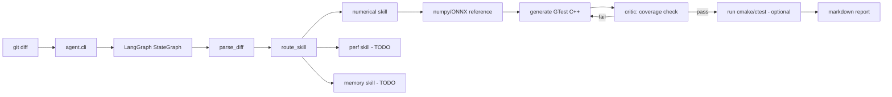

# tinyinfer-agent

**AI 推理框架回归测试自动化 Agent** —— 看 C++ 算子改动,自动生成数值精度 / 性能 / 内存三维回归测试,用 ONNX/numpy 作为 reference oracle。

> 本仓库是项目 MVP 骨架,目标 4-6 周完整版。当前完成度见 [`docs/ROADMAP.md`](docs/ROADMAP.md)。

## Why this project

通用代码生成 Agent 满大街都是,但**针对 AI 推理框架的回归测试**几乎没人做。
推理框架改动(改算子、改 quantization、改 memory layout)需要同时验证:

| 维度 | 普通测试 | 推理框架 |
|------|---------|---------|
| 逻辑正确 | ✅ | ✅ |
| **数值精度**(对照 reference) | ❌ | ✅ |
| **性能**(p50/p99 延迟无退化) | ❌ | ✅ |
| **内存**(峰值/泄漏) | ❌ | ✅ |
| **跨硬件一致性** | ❌ | ✅ |

本 Agent 把这五个维度作为 first-class concern,基于 LangGraph 编排
`parse_diff → skill_route → generate_tests → critic → execute → report` 流水线。

## Architecture(MVP)



## Quick start

```bash
cd D:/tinyinfer-agent

# 1. 安装 Python deps
python -m venv .venv
.venv/Scripts/Activate.ps1
pip install -e ".[dev]"

# 2. 配置 LLM(任选其一,或用 mock 模式)
copy .env.example .env
# 编辑 .env 填入 DEEPSEEK_API_KEY 或 OPENAI_API_KEY

# 3. 跑一个 mock demo(不需要 API key)
python -m agent.cli analyze --diff demo/diffs/sample_matmul.diff --mock

# 4. 真实 LLM 调用
python -m agent.cli analyze --diff demo/diffs/sample_matmul.diff
```

## C++ 被测项目

`tinyinfer/` 下是一个 mini operator library,作为 Agent 的"被测对象":

```bash
cd tinyinfer
cmake -S . -B build
cmake --build build
ctest --test-dir build
```

当前包含算子:`matmul`(更多 TODO,见 ROADMAP)。

## 项目结构

```
tinyinfer-agent/
├── agent/                    # Python Agent 实现
│   ├── graph/                # LangGraph StateGraph 与节点
│   ├── skills/               # 测试领域 Skills(numerical/perf/memory)
│   ├── tools/                # 工具函数(reference oracle、cmake driver)
│   ├── llm/                  # LLM client 抽象
│   ├── tracing/              # JSONL trace writer
│   ├── state.py              # AgentState 定义
│   └── cli.py                # 命令行入口
├── tinyinfer/                # C++ 被测项目
│   ├── include/tinyinfer/    # 公开头文件
│   ├── src/                  # 算子实现
│   └── tests/                # GoogleTest 测试
├── demo/
│   ├── diffs/                # 示例 diff
│   └── generated_tests/      # Agent 生成的测试落地处
├── docs/
│   ├── ARCHITECTURE.md
│   ├── ROADMAP.md
│   └── research-log/
├── tests/                    # Python 单测
└── pyproject.toml
```

## Docs

- [`docs/ARCHITECTURE.md`](docs/ARCHITECTURE.md) — graph design and key decisions
- [`docs/ROADMAP.md`](docs/ROADMAP.md) — 4-6 week project plan
- [`docs/MCP.md`](docs/MCP.md) — MCP stdio server and Claude Desktop integration
- [`docs/research-log/00-kickoff.md`](docs/research-log/00-kickoff.md) — first devlog

## Roadmap

详见 [`docs/ROADMAP.md`](docs/ROADMAP.md)。

- [x] **Week 1 MVP**:LangGraph 主循环 + matmul 算子 + numerical skill 跑通
- [x] **Week 2 (MCP)**:自定义 MCP server + agent 通过 MCP 协议执行测试(install + execute 节点)
- [x] **Week 2 (skills)**:softmax/layernorm 算子 + perf/memory skills + diff-aware routing
- [ ] **Week 2 (next)**:fault-injection benchmark、基线 accuracy 测量
- [ ] **Week 3**:Milvus + RAG 接入算子文档、Critic 多维覆盖
- [ ] **Week 4**:fault-injection benchmark、Streamlit UI、CI、devlog

## License

MIT
