# tinyinfer-agent

**AI 推理框架回归测试自动化 Agent** —— 看 C++ 算子改动，自动生成数值精度 / 性能 / 内存三维回归测试，用 ONNX/numpy 作为参考 oracle。

> 本仓库是 4-6 周的个人项目，当前完成度见 [`docs/ROADMAP.md`](docs/ROADMAP.md)。

## 项目动机

通用代码生成 Agent 满大街都是，但**针对 AI 推理框架的回归测试**几乎没人做。
推理框架改动（改算子、改 quantization、改 memory layout）需要同时验证：

| 维度 | 普通测试 | 推理框架 |
|------|---------|---------|
| 逻辑正确 | ✅ | ✅ |
| **数值精度**（对照 reference） | ❌ | ✅ |
| **性能**（p50/p99 延迟无退化） | ❌ | ✅ |
| **内存**（峰值/泄漏） | ❌ | ✅ |
| **跨硬件一致性** | ❌ | ✅ |

本 Agent 把这五个维度作为一等公民，基于 LangGraph 编排
`parse_diff → route_skill → retrieve_context → generate_tests → critic → install → execute → report` 流水线。

## 架构（MVP）

```mermaid
flowchart LR
    User[git diff] --> CLI[agent.cli]
    CLI --> Graph[LangGraph StateGraph]
    Graph --> ParseDiff[parse_diff]
    ParseDiff --> Route[route_skill]
    Route --> RAG[retrieve_context<br/>BM25+dense+RRF]
    RAG --> NumSkill[numerical / perf / memory skills]
    NumSkill --> Oracle[numpy reference oracle]
    Oracle --> GenTest[渲染 GTest C++]
    GenTest --> Critic[critic：结构化 + LLM]
    Critic -->|FAIL + Reflexion lesson| GenTest
    Critic -->|PASS| Install[install_tests]
    Install --> Exec[execute via MCP<br/>cmake/ctest]
    Exec --> Report[markdown report]
```



## 快速上手

```bash
cd D:/tinyinfer-agent

# 1. 装 Python 依赖
python -m venv .venv
.venv/Scripts/Activate.ps1
pip install -e ".[dev,rag]"

# 2. 配置 LLM（任选其一，或用 mock 模式）
copy .env.example .env
# 编辑 .env 填入 DASHSCOPE_API_KEY / DEEPSEEK_API_KEY / OPENAI_API_KEY 等

# 3. 跑一个 mock demo（不需要 API key）
python -m agent.cli analyze --diff demo/diffs/sample_matmul.diff --mock

# 4. 真实 LLM 调用（Qwen）
LLM_PROVIDER=qwen python -m agent.cli analyze --diff demo/diffs/sample_matmul.diff
```

## C++ 被测项目

`tinyinfer/` 下是一个 mini 算子库，作为 Agent 的"被测对象"：

```bash
cd tinyinfer
cmake -S . -B build
cmake --build build
ctest --test-dir build
```

当前包含算子：`matmul_fp32` / `softmax_fp32` / `layernorm_fp32`（更多见 ROADMAP）。

## 项目结构

```
tinyinfer-agent/
├── agent/                    # Python Agent 实现
│   ├── graph/                # LangGraph StateGraph 与节点
│   ├── skills/               # 测试领域 skills（numerical/perf/memory）
│   ├── tools/                # 工具函数（reference oracle、cmake driver、cpp renderer）
│   ├── llm/                  # LLM client + Embedding client 抽象
│   ├── rag/                  # 向量库 + BM25 + RRF 混合检索
│   ├── mcp/                  # 自定义 MCP server + client
│   ├── tracing/              # JSONL trace writer + LangSmith 可选集成
│   ├── ui/                   # Streamlit UI
│   ├── state.py              # AgentState 定义
│   └── cli.py                # 命令行入口
├── tinyinfer/                # C++ 被测项目
│   ├── include/tinyinfer/    # 公开头文件
│   ├── src/                  # 算子实现
│   └── tests/                # GoogleTest 测试
├── benchmark/                # Fault-injection benchmark
│   ├── seeds/                # 10 条人工种子 diff
│   ├── harness.py            # Agent 跑批 + 启发式裁定
│   └── compare.py            # 多配置 ablation 对比
├── demo/
│   ├── diffs/                # 示例 diff
│   └── generated_tests/      # Agent 生成的测试落地处
├── docs/                     # 架构 / Roadmap / MCP / Devlogs（全中文）
├── results/                  # Ablation 结果 JSON + 对比表
├── tests/                    # Python 单测（103 个）
└── pyproject.toml
```

## 文档

- [`docs/ARCHITECTURE.md`](docs/ARCHITECTURE.md) —— 图结构与关键设计决策
- [`docs/ROADMAP.md`](docs/ROADMAP.md) —— 4-6 周项目计划
- [`docs/MCP.md`](docs/MCP.md) —— MCP stdio server 与 Claude Desktop 集成
- [`docs/DEFERRED_VALIDATION.md`](docs/DEFERRED_VALIDATION.md) —— 待新机器验证清单
- [`docs/research-log/`](docs/research-log/) —— 每周 devlog（7 篇）

## 当前进度

- [x] **Week 1 MVP**：LangGraph 主循环 + matmul 算子 + numerical skill 跑通
- [x] **Week 2（MCP）**：自定义 MCP server + agent 通过 MCP 协议执行测试（install + execute 节点）
- [x] **Week 2（skills）**：softmax/layernorm 算子 + perf/memory skills + diff 内容感知路由
- [x] **Week 3**：Hybrid RAG（BM25+dense+RRF，默认 Chroma）+ 带检索上下文的 LLM critic + self-consistency + 10 条 fault-injection benchmark
- [x] **Week 4（可本地验证部分）**：Streamlit UI + Docker compose（Qdrant / Milvus 可选）+ LangSmith 自动 trace（环境变量即开即用）+ devlogs
- [x] **Ablation（Qwen + DashScope）**：RAG 把 critic 误报的 "missing dimensions" 从 2.60 降到 0.60，详见 [`docs/research-log/05-ablation-results.md`](docs/research-log/05-ablation-results.md)
- [x] **Reflexion（负向结果）**：critic FAIL 反馈喂回 generator，但本 benchmark 上没显著提升，详见 [`docs/research-log/06-reflexion-negative-result.md`](docs/research-log/06-reflexion-negative-result.md)
- [ ] **Deferred 到新机器**：cmake/ctest 真实执行、Docker compose 起服务、Streamlit 交互验收、LangSmith dashboard。详见 [`docs/DEFERRED_VALIDATION.md`](docs/DEFERRED_VALIDATION.md)

## License

MIT
